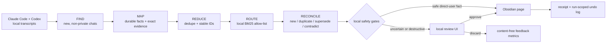

<div align="center">

# dream-skill

**turn what you tell Claude and Codex into durable, reviewable Obsidian memory**

[](LICENSE)
[](https://docs.anthropic.com/en/docs/claude-code)
[](https://developers.openai.com/codex/)
[](#development)

[Why](#the-problem) · [How it works](#how-it-works) · [Install](#install) · [Run](#run) · [Review](#review-uncertain-changes) · [Safety](#safety-model)

</div>

---

## The problem

A personal wiki makes an AI assistant dramatically more useful—but only while the wiki still describes the person using it.

Real life changes faster than carefully maintained Markdown. A role ends. A project changes direction. A preference becomes a rule. A health experiment starts. You mention each change naturally in Claude Code or Codex, but the durable page an agent reads next month remains stale.

**dream-skill closes that gap.** It scans new local conversations, extracts only durable personal context, finds the small set of canonical pages where each fact could belong, and either writes a safe addition or puts the decision in a local review queue.

It is not a transcript archive. Commits, shell history, file lists, test receipts, temporary debugging, and detailed narration of agent work are deliberately discarded. Dream keeps the parts that help a future agent understand *you*.

## What it does

- Reads local Claude Code and Codex conversation transcripts incrementally.
- Preserves user/assistant role and exact evidence provenance through extraction.
- Extracts compact facts about identity, preferences, relationships, health, goals, life state, and durable project context.
- Retrieves candidate Obsidian pages locally with weighted BM25, then lets an agent choose only inside that bounded allow-list.
- Compares each candidate with a bounded snapshot of the target section before deciding whether it is new, duplicate, superseding, or contradictory.
- Auto-writes only validator-approved, high-confidence facts stated directly by the user.
- Routes uncertain, destructive, stale, sensitive, or unusually dense changes into a local browser review UI.
- Records receipts, content-free quality metrics, stable candidate IDs, and run-scoped undo logs.
- Supports shadow canaries that exercise the complete pipeline without touching vaults, queues, receipts, or production cursors.

## How it works



The agent never receives unrestricted write access. MAP, ROUTE, and RECONCILE run in a read-only sandbox; deterministic local validators own destinations, confidence policy, review gates, and Markdown mutation.

## A concrete example

Suppose a configured page still contains:

```markdown
- Current role: AI engineering intern at Example Health
```

Later, you tell Codex:

```text
My internship ended last Friday. I'm back to working full-time on the agency.
```

Dream preserves that user-authored evidence, retrieves only plausible canonical pages, and reconciles it against the existing section. Because replacing a current-state fact is destructive, it does **not** silently edit the page. It creates a review card with the proposed replacement, the exact old line, the source chat, and bounded evidence. Approval applies the exact change transactionally; rejection leaves the vault untouched.

By contrast, a new high-confidence preference with no conflicting old line can be appended automatically when the page, section, and vault policies all allow it.

## Install

### Claude Code plugin

```text
/plugin marketplace add BohdanChuprynka/skills
/plugin install dream-skill@skills
```

### Local Claude Code + Codex install

```bash
git clone https://github.com/BohdanChuprynka/skills.git
cd skills/dream-skill
./setup.sh
```

The setup script:

- symlinks the Claude Code skill from this checkout;
- creates a self-contained Codex skill under `~/.codex/skills/dream-skill/`;
- preserves an existing `~/.claude/dream-skill/config.toml`;
- initializes private runtime directories with restrictive permissions.

Requirements: Python 3, `jq`, and at least one supported agent CLI (`codex` or `claude`). The transcript source and the agent engine are independent: Codex can process Claude transcripts, and Claude can process Codex transcripts.

## Configure

On first setup, Dream copies [`config.example.toml`](config.example.toml) to:

```text
~/.claude/dream-skill/config.toml
```

Point each vault entry at a real Obsidian vault and describe what belongs there:

```toml
reports_dir = "/absolute/path/to/dream-reports"

[vaults.personal]
root = "/absolute/path/to/personal-vault"
description = "Identity, preferences, goals, relationships, and long-lived context."

[vaults.projects]
root = "/absolute/path/to/projects-vault"
description = "Repositories, architecture, constraints, and technical decisions."
```

Optional vault policies provide a harder boundary:

```toml
[vaults.notes]
root = "/absolute/path/to/notes-vault"
description = "User-authored reference notes."
review_only = true
route_include = ["Notes", "References"]
route_exclude = ["Templates", "_archive"]
```

Real paths and private routing terms remain in the local config and should never be committed.

## Run

Start with a shadow canary:

```text
# Claude Code
/dream-skill --shadow

# Codex
Use $dream-skill --shadow
```

Shadow mode runs every stage and records only content-free metrics, private diagnostics, and a separate shadow cursor. It does not change a vault, review queue, receipt, or production marker.

When the canary is healthy, run a real incremental sync:

```text
# Claude Code
/dream-skill

# Codex
Use $dream-skill
```

You can also call the runner directly:

```bash
python3 scripts/dream-run.py --source all --shadow
python3 scripts/dream-run.py --source all
```

### Useful flags

| Flag | Behavior |
|---|---|
| `--shadow` | Full canary with no vault, queue, receipt, or production-marker mutation |
| `--dry-run` | One-off operator preview |
| `--since YYYY-MM-DD` | Override the beginning of the source window |
| `--all` | Deliberate historical backfill, processed in weekly batches |
| `--source claude\|codex\|all` | Choose transcript sources |
| `--engine codex\|claude` | Choose the CLI that runs MAP, ROUTE, and RECONCILE |
| `--historical-current-review-days N` | Review old current-state facts instead of silently presenting them as current |
| `--quality-review-sample-percent N` | Send a deterministic sample of otherwise safe facts through review |
| `--resume RUN_ID` | Resume a retained failed or shadow run without moving its time boundary |
| `--promote-shadow` | Explicitly allow a reviewed shadow run to become a real write |
| `--ignore` / `--unignore` | Exclude or restore the current transcript for future Dream runs |

Run `python3 scripts/dream-run.py --help` for model, effort, retry, concurrency, density, and recovery controls.

## Review uncertain changes

Dream ships a dependency-free local review UI. Build a snapshot of the current queue, then serve it on loopback:

```bash
DREAM_HOME="${DREAM_HOME:-$HOME/.claude/dream-skill}"

python3 scripts/build-review-queue.py \
  --pending-md "$DREAM_HOME/queue/pending.md" \
  --sidecars-dir "$DREAM_HOME/queue/sidecars" \
  --output "$DREAM_HOME/queue/review-input.json" \
  --existing-decisions "$DREAM_HOME/queue/review-decisions.json"

python3 scripts/serve-review.py \
  --queue "$DREAM_HOME/queue/review-input.json" \
  --decisions "$DREAM_HOME/queue/review-decisions.json" \
  --feedback "$DREAM_HOME/queue/review-feedback.json"
```

Cards retain exact source provenance and can be filtered by cohort, vault, page, memory tier, historical status, quality sample, and fact class. Discards collect a structured reason so quality improvements can be attributed to extraction, deduplication, routing, wording, or staleness without retaining the rejected fact in metrics.

Apply decisions only from that exact review snapshot:

```bash
scripts/apply-review-decisions.sh \
  --decisions "$DREAM_HOME/queue/review-decisions.json" \
  --review-input "$DREAM_HOME/queue/review-input.json" \
  --sidecars-dir "$DREAM_HOME/queue/sidecars" \
  --undo-log "$DREAM_HOME/undo/legacy-review-fallback.jsonl"
```

## Safety model

- **Configured roots only.** Vault destinations come from local TOML config; model output cannot introduce a root.
- **Bounded routing.** The router chooses only among canonical pages retrieved locally. Archived, completed, raw, log, and excluded surfaces are filtered out.
- **No invented pages.** Missing or ambiguous destinations become routing gaps.
- **Direct-user evidence.** Assistant statements are context, not high-confidence facts unless the user confirmed them.
- **Review before destruction.** Supersedes and contradictions require an exact old Markdown line and human approval.
- **Local policy gates.** New-person facts, cross-target conflicts, old current-state facts, review-only vaults, and density overflows cannot auto-write.
- **Transactional writes.** Apply failures retain their queue entries; no-op retries do not create undo records.
- **Run-scoped rollback.** Modern undo events include both run and candidate IDs and are validated before mutation.
- **Marker gating.** A failed stage never advances a production source cursor.
- **Private runtime state.** Runtime directories use mode `0700`; files use `0600`.
- **Prompt-injection resistance.** Transcript text is untrusted data and cannot redefine schemas, confidence, prompts, or destinations.

## Engines and cost

Dream uses Codex by default and can use Claude for the three model-assisted stages:

```bash
python3 scripts/dream-run.py --engine codex --source all --shadow
python3 scripts/dream-run.py --engine claude --source all --shadow
```

FIND, deduplication, retrieval, policy gates, writing, rollback, and metrics are local. Cost comes from MAP, ROUTE, and RECONCILE calls and varies with transcript volume, selected model, reasoning effort, provider plan, and cache behavior. Receipts and content-free metrics record observed token usage and cost when the engine exposes them; this README intentionally avoids a fixed dollar promise.

## Operations

Check runtime health without printing candidate content:

```bash
python3 scripts/dream-health.py --human
```

The health report covers source-marker age, failed runs, queue/sidecar integrity, routing gaps, storage, and unsafe permissions. Failed runs remain resumable under `~/.claude/dream-skill/runs/`; routing misses remain private under `~/.claude/dream-skill/gaps/`.

Rollback a modern run:

```bash
scripts/apply-undo.sh --run-id <run-id> --home "${DREAM_HOME:-$HOME/.claude/dream-skill}"
```

## Development

Run the complete shipped suite before changing the pipeline and again before committing:

```bash
tests/run.sh
```

Correctness and safety fixes require regression coverage. Prompt or routing-contract changes should remain bounded and measurable; deterministic local validation is preferred over adding more model calls.

## FAQ

**Does Dream run after every session?**

No. Dream is an explicit or scheduled batch pipeline. The Claude hook only reports pending review work at session start.

**Does it upload my entire Obsidian vault?**

No. Local retrieval produces a bounded canonical-page allow-list, and reconciliation receives bounded target-section context. Model-assisted stages still send the context required for their task to the selected provider.

**Can it work with one vault?**

Yes. Configure one or many vaults. Each vault can have its own description, routing scope, and review-only policy.

**Why not use embeddings?**

Dream currently uses deterministic weighted BM25 and a targeted fallback for ambiguous or missing routes. Embeddings are intentionally deferred until measured misses show that bounded lexical retrieval is insufficient.

**Can I replay old conversations?**

Yes, with `--all` or `--since`. Historical current-state facts are automatically downgraded to review after the configured age threshold so stale operational context is not silently written as present tense.

## License

MIT — see [`LICENSE`](LICENSE).

---

Built by [Bohdan Chuprynka](https://github.com/BohdanChuprynka). The original standalone repository remains at [`BohdanChuprynka/dream-skill`](https://github.com/BohdanChuprynka/dream-skill); current development lives in the [`skills` monorepo](https://github.com/BohdanChuprynka/skills/tree/main/dream-skill).
