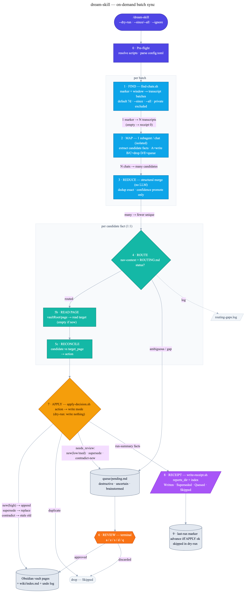

<div align="center">

<h1>dream-skill</h1>

<p><strong>One observable command sweeps every Claude Code chat since you last ran it, and syncs the durable facts into your Obsidian vault — with a per-run receipt so you can <em>see</em> exactly what it did.</strong></p>

<p>
  <a href="LICENSE"></a>
  <a href="https://github.com/BohdanChuprynka/skills/stargazers"></a>
  
  
</p>

<p>
  <a href="#how-it-works">How it works</a> &middot;
  <a href="#install">Install</a> &middot;
  <a href="#modes">Modes</a> &middot;
  <a href="#observability">Observability</a> &middot;
  <a href="#dry-run-vs-full-run">Dry-run vs full run</a> &middot;
  <a href="#safety">Safety</a> &middot;
  <a href="#faq">FAQ</a>
</p>

</div>

---

## The problem

You close Claude Code. The conversation had decisions, preferences, new project context — gone unless you remembered to `/sync-wiki` first. Skip it for a week and future sessions re-ask things you already told them.

The earlier auto-on-close design (v0.2) tried to fix this by firing a headless capture on every `SessionEnd`. It worked, but it was **invisible and hard to trust**: a per-session hook spawning an LLM in the background, no single artifact showing what happened, and context that ballooned when a session was large.

**v0.3 inverts that.** Capture is decoupled from extraction. Nothing runs on close. Instead you run **`/dream-skill`** when you want, and it sweeps every chat since the last run as one observable batch — fan out a subagent per chat, merge, route, reconcile against the vault, let you review the uncertain ones, write, and drop a **receipt** you can read in Obsidian.

## What dream-skill does

- **On-demand, not automatic.** You run it. No background hook firing on every session close.
- **Batch, not per-session.** One run covers every unprocessed chat in the window (default: last 7 days, tracked by a `last-run` marker).
- **Map-reduce over chats.** One isolated subagent per transcript — so a giant session can't blow up the context of the whole run.
- **Reconciles, doesn't just append.** Each candidate fact is compared against the actual target page: is it new, a duplicate, a newer version that supersedes an old line, or a contradiction?
- **Observable.** Every run writes a dated **receipt** (`Written · Superseded · Queued · Skipped`) to a `dream-reports/` folder inside Obsidian. That artifact is the point.
- **Reviewable.** Destructive or low-confidence facts go to a queue you walk fact-by-fact in the terminal (`approve / edit / skip / discard`).
- **Reversible.** Every write is logged; `apply-undo.sh --date <YYYY-MM-DD>` rolls back a day.
- **Safe to re-run.** Idempotent writes + a marker that only advances on success mean re-running never double-writes.

## How it works



<sub>Diagram source: [`docs/architecture.mmd`](docs/architecture.mmd) (Mermaid). Regenerate with `mmdc -i docs/architecture.mmd -o docs/architecture.png -b white -s 3`.</sub>

The orchestrator (`SKILL.md`, Steps 0–9) runs a nine-stage pipeline. The shape that matters: a **fan-out → fan-in**, then strictly **one decision per candidate fact**.

| Stage | Owner | What happens |
|---|---|---|
| **0 · Pre-flight** | SKILL.md | Resolve the scripts dir; parse `config.toml` (vault roots + `reports_dir`). Handle `--ignore`/`--dry-run`. |
| **1 · FIND** | `find-chats.sh` | `last-run` marker + window → batches of transcript paths. Default **last 7 days**; `--since` / `--all` (weekly-batched). Private (`--ignore`d) chats excluded. Empty window → receipt "0 chats" and advance. |
| **2 · MAP** | one subagent per chat | Each isolated subagent reads one transcript, applies the A/B/C/D/E taxonomy (A = write-candidate, B/C = drop, D/E = queue), and emits a JSON array of **candidate facts**. |
| **3 · REDUCE** | SKILL.md (structural) | Merge all candidate arrays; dedup exact `(content, section)`; count distinct source chats → may **promote a confidence label**. Never clears `needs_review`, never auto-approves. |
| **4 · ROUTE** | `build-nav-context.sh` + `ROUTING.md` | Per candidate → `{status, vault, page, section}`. `status ∈ routed | ambiguous | gap`. Ambiguous/gap → routing-gaps log + review queue (never a silent guess). |
| **5 · RECONCILE** | reconciliation prompt | Read the routed target page, then classify the candidate against it: `action ∈ new | duplicate | supersede | contradict`. |
| **6 · REVIEW** | `queue.sh` | Everything `needs_review` (all destructive edits, all low/medium-confidence news) is walked fact-by-fact in the terminal. |
| **7 · APPLY** | `apply-decision.sh` → `vault-writer.sh` | Owns `action → mode`: `new`→append, `supersede`→replace (old line preserved in undo), `contradict`→mark old line stale + queue the new one, `duplicate`→skip. |
| **8 · RECEIPT** | `write-receipt.sh` | Assemble the run summary → `reports_dir/<date>.md` + index line. Buckets: **Written · Superseded · Queued · Skipped**. |
| **9 · MARKER** | SKILL.md | Advance `last-run` to the batch end date — **only** if APPLY succeeded. A failed write leaves the marker put, so the next run safely retries. |

## Install

```bash
/plugin marketplace add BohdanChuprynka/skills
/plugin install dream-skill@skills
```

**No `SessionEnd` hook** — nothing runs when you close a session; capture happens only when you run `/dream-skill`. (The plugin still registers a legacy `SessionStart → check-pending.sh` script from v0.2. It is silent — it scans the old `trigger.log` and writes nothing to stdout — so on a clean v0.3 install it is effectively a no-op. A real "N chats since last run" nudge is a planned follow-up.)

**First run:** create `~/.claude/dream-skill/config.toml` pointing at your vault(s):

```toml
# Where per-run receipts go (a sibling folder of your vaults, visible in Obsidian).
reports_dir = "/path/to/Obsidian/dream-reports"

[vaults.me]
root = "/path/to/Obsidian/me"
description = "Identity, skills, experience, projects, career, goals"

[vaults.projects]
root = "/path/to/Obsidian/projects"
description = "Repos, architecture, tech stack, current goals, known issues"
```

Each vault root should have a `CLAUDE.md` (the schema Claude reads) and a `wiki/index.md` (the page catalog). `vault-writer.sh` keeps the index updated idempotently. If `config.toml` is missing or empty, dream-skill prompts you to configure it before doing anything.

## Modes

| Invocation | What it does |
|---|---|
| `/dream-skill` | Run the on-demand pipeline over every chat since `last-run`, then open the terminal review. |
| `/dream-skill --dry-run` | Run the **entire** pipeline but write nothing — receipt prints to stdout. See [below](#dry-run-vs-full-run). |
| `/dream-skill --since <YYYY-MM-DD>` | Override the window start. |
| `/dream-skill --all` | Full-history backfill, weekly-batched. Use only once the pipeline is trusted. |
| `/dream-skill --ignore` | Mark the **current** chat private — it's excluded from the next run (undo: `--unignore`). |
| `/dream-skill --unignore` | Re-include a previously ignored chat (latest wins). |
| `/dream-skill --help` | Print the modes, env vars, and state paths. Exits without writing. |

> Removed in v0.3: `--auto` (the headless on-close entry point) and `--reconcile` (the earlier v0.2 audit stub). Reconciliation is no longer a separate mode — it's Step 5 of every run.

## Observability

The thing v0.2 lacked. After every run you have four places to look, all local:

- **Receipt** — `reports_dir/<YYYY-MM-DD>.md`, plus a one-line entry in `reports_dir/index.md`. Bucketed `Written / Superseded / Queued / Skipped`, with the source chats and the exact lines. This is the "I can see it worked" artifact — glance at it inside Obsidian, no leaving the editor.
- **Queue** — `~/.claude/dream-skill/queue/pending.md`. Anything that needed your judgment, still waiting.
- **Routing-gaps log** (`~/.claude/dream-skill/routing-gaps.log`) — facts that had nowhere obvious to go (ambiguous vault, or no page exists yet). Surfaces where your vault needs a new page or a disambiguation rule; fold recurring gaps into `ROUTING.md`.
- **Undo log** — `~/.claude/dream-skill/undo/<date>.jsonl`. Every write, reversible.

## Dry-run vs full run

Both run the **identical** pipeline — FIND → MAP → REDUCE → ROUTE → RECONCILE → REVIEW. The only difference is what **APPLY** (Step 7) and onward are allowed to touch:

| | `--dry-run` | full run |
|---|---|---|
| FIND … RECONCILE | runs normally | runs normally |
| Vault pages | **untouched** — `vault-writer.sh` prints the intended change and exits | appended / replaced / marked-stale for real |
| Queue writes | skipped | real entries created |
| Undo log | not written | written |
| Receipt | rendered to **stdout** (proposed edits) | written to `reports_dir` |
| `last-run` marker | **not advanced** | advanced to batch end |

So a dry-run is a zero-mutation preview: you see precisely what *would* happen, and a second dry-run produces the same plan. Use it for the first shakedown of a new vault, or any time you want to look before you leap.

## Safety

- **Reversible writes.** Append, replace, and stale-marking all log to the per-day undo file. `bash scripts/apply-undo.sh --date <YYYY-MM-DD>` reverses a day.
- **No silent destructive edits.** Every `supersede` and `contradict` goes through the review queue; the model never overwrites vault content without surfacing it.
- **No silent routing guesses.** Ambiguous/gap routing is logged and queued, never written to a guessed page.
- **Marker integrity.** The `last-run` marker advances only after a clean APPLY. A failed write → marker stays → next run retries the same window; idempotent writes mean retries don't duplicate.
- **Dry-run guarantee.** The vault is byte-identical and the queue is untouched after a `--dry-run` APPLY (enforced by tests). The `last-run` marker is also left unadvanced on a dry-run, per the Step 9 orchestration rule.
- **Private opt-out.** `--ignore` keeps a chat out entirely — no subagent reads it, nothing from it is recorded.

## Privacy

- All processing is local. Transcripts are read from the `~/.claude/projects/<slug>/*.jsonl` files Claude Code already wrote.
- The only model calls are the subagents dispatched inside your normal Claude Code session — identical to any other Claude Code work. No telemetry, no third-party services, vault paths never leave your machine.
- **Keeping a chat private:** type `/dream-skill --ignore` in that chat. At the next run, `find-chats.sh` (via `private-state.sh`) excludes it — no extraction, no writes. `--unignore` reverses it (latest decision wins, covers the whole chat).

## State layout

All runtime state lives under `~/.claude/dream-skill/` and survives plugin updates:

```
~/.claude/dream-skill/
├── config.toml            # vault roots + reports_dir (you create this)
├── last-run               # marker: the batch end date of the last successful run
├── queue/pending.md       # deferred-decision facts (destructive / uncertain / brainstormed)
├── log/<date>.md          # per-day human-readable activity log
├── undo/<date>.jsonl       # per-write rollback entries
├── routing-gaps.log        # ambiguous/gap routing decisions (review → fold rules into ROUTING.md)
└── error.log              # broken-install / failed-step diagnostics
```

Receipts live in the `reports_dir` from `config.toml` (a folder beside your vaults, so they show up in Obsidian) — **not** under `~/.claude`.

Env overrides (rarely needed): `DREAM_HOME`, `DREAM_CONFIG`, `DREAM_QUEUE_FILE`, `DREAM_DAILY_LOG`, `DREAM_UNDO_LOG`, `DREAM_ERROR_LOG`, `DREAM_MARKER_DIR`, `DREAM_SCRIPTS_DIR`. All have sensible defaults.

## How it relates to the other vault skills

dream-skill is the bulk, automated path. It pairs with two manual ones:

- **`/sync-wiki`** — syncs **one** conversation (the current one) to the vault. dream-skill is essentially "sync-wiki, but every chat since last time, in one observable batch."
- **`/clean-wiki`** — monthly vault hygiene: finds stale facts, contradictions, broken links, and duplicate pages, then lets you swipe approve/reject. Run it **before** a first big dream-skill sweep so reconciliation routes facts to canonical pages instead of drifted duplicates.

## FAQ

**Q: Does anything still run automatically when I close a session?**
No. That was v0.2. Capture happens only when *you* run `/dream-skill`. (A legacy `SessionStart` script still ships but is silent and does nothing on a clean v0.3 install — see Install.)

**Q: How do I know it actually did something?**
Read today's receipt in `reports_dir/<date>.md` — it lists every fact Written, Superseded, Queued, or Skipped, with sources. That artifact is the whole design goal.

**Q: How much does a run cost?**
One subagent per chat in the window, plus the reduce/route/reconcile steps — all inside your normal Claude Code session (covered on Pro/Max/Team). A week with ~10 substantive chats is ~10 subagent dispatches. Narrow the window with `--since` to spend less.

**Q: I ran it twice — did my vault get polluted?**
No. `vault-writer.sh` is line-idempotent (exact-match append guard), the queue dedupes by `(title, target)`, and the marker only advances on success. Worst case is wasted work on a re-scan that produces zero new writes.

**Q: A giant session used to blow up the run. Still true?**
No — that was the v0.2 failure mode. MAP now dispatches one **isolated** subagent per chat, and monster transcripts (>~100 KB) are chunked inside that subagent. No single chat can overflow the run's context.

**Q: What's the difference between `supersede` and `contradict`?**
`supersede` = same subject, the candidate is clearly newer/more specific → the old line is replaced (and queued for confirmation). `contradict` = the claims conflict but there's no clear winner → the old line is marked stale and the new one is queued for you to decide, not written.

**Q: Where do writes go, and how do I undo them?**
Into your Obsidian vault pages (per routing), with the index updated. Every write is in `~/.claude/dream-skill/undo/<date>.jsonl`; roll back a day with `bash scripts/apply-undo.sh --date YYYY-MM-DD`.

## Troubleshooting

Run these first:

```bash
ls ~/.claude/dream-skill/             # config.toml + queue/ + log/ + undo/ should exist
cat ~/.claude/dream-skill/error.log   # failed-step diagnostics
claude --version                      # any v1.x / v2.x
which jq                              # must return a path (brew install jq / apt install jq)
```

| Symptom | Cause | Fix |
|---|---|---|
| "No last-run marker found" prompt every run | Marker missing (first run) | Pick a window (1 = last 7 days is recommended); the marker is written on success. |
| Run finds 0 chats | Window is empty, or all chats `--ignore`d | Widen with `--since <date>` or `--all`. |
| Facts pile up in the queue, few written | Routing can't find canonical pages | Run `/clean-wiki` to merge duplicate pages; add disambiguation rules to `ROUTING.md`. |
| `error.log` shows `missing <script>` | Scripts dir not resolved | Reinstall the plugin; verify `scripts/` is intact. |
| Scripts fail with `jq: command not found` | `jq` not installed | `brew install jq` / `apt install jq`. |
| Vault on iCloud, write fails | iCloud sync conflict | Move the vault out of iCloud, or use local-only mode. |

## Roadmap

- **v0.3** (current) — on-demand batch sweep, map-reduce extraction, per-candidate reconciliation, terminal review, in-vault receipts, dry-run.
- **Next** — first-run config wizard; richer receipt diffs; a `volatility`-aware reconcile pass for fast-changing pages.

## Docs

- [`docs/architecture.mmd`](docs/architecture.mmd) — architecture diagram source (renders the image above)
- [SKILL.md](skills/dream-skill/SKILL.md) — runtime instructions Claude reads (Steps 0–9, Routing, Reconciliation)
- [REDESIGN-2026-06-03-on-demand-batch.md](REDESIGN-2026-06-03-on-demand-batch.md) — the approved redesign spec
- [PLAN-OVERVIEW-2026-06-03.md](PLAN-OVERVIEW-2026-06-03.md) — normative data contracts (candidate-fact, routing-decision, reconciliation-decision)
- [HARVEST.md](HARVEST.md) — patterns ported from v0.1

## License

MIT
